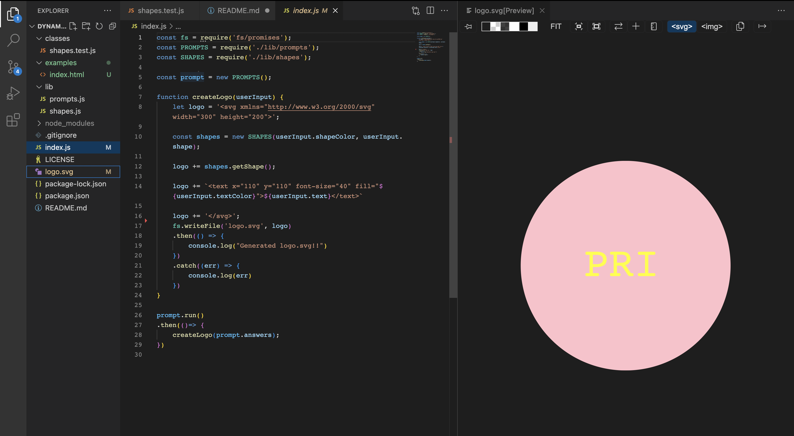

# Dynamic SVG Logo Generator

## Command-line application which dynamically generates a logo upon user inputs in the terminal. As the user answers questions, the application is coded to use those inputs and dynamically create an image or logo for the client in SVG format.

## Installation
+ Node.js must be installed to the user's device in order for this application to function
+ The NPM package, Inquirer (version ^8.2.4) must be installed for this application to function accurately
+ The NPM Jest package must also be installed for testing

## Usage

+ Link to Screencastify: https://drive.google.com/file/d/1PNcUOE5DkoFHPQfTKAlCb1WA4LK30wP6/view
+ Link to Github Repo: https://github.com/priyanka-agrawal025/dynamic-logo-generator

## Credits
+ There were no collaborators on this project

## Licenses
+ An MIT License was used for this project

## Badges

